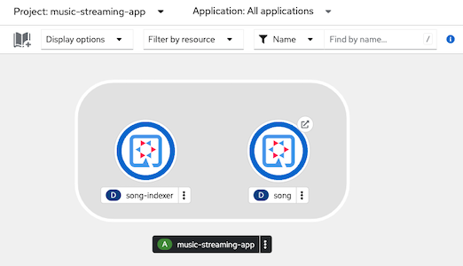
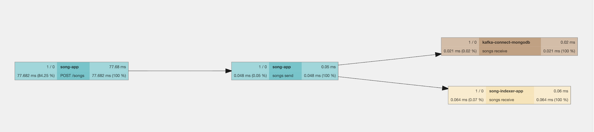

# AMQ Sterams on OpenShift
- [AMQ Sterams on OpenShift](#amq-sterams-on-openshift)
  - [Install AMQ Streams Operators](#install-amq-streams-operators)
  - [Create Kafka Cluster](#create-kafka-cluster)
  - [Demo Application](#demo-application)
  - [Observability](#observability)
    - [OpenTelemetry](#opentelemetry)
      - [Install and configure Jager and OTEL](#install-and-configure-jager-and-otel)
      - [Deploy app with OTEL enabled](#deploy-app-with-otel-enabled)
      - [Jaeger Console](#jaeger-console)
    - [Config user workload monitoring](#config-user-workload-monitoring)
    - [Grafana Dashboard](#grafana-dashboard)
  - [Kafka Connect MongoDB](#kafka-connect-mongodb)

## Install AMQ Streams Operators
- Install AMQ Streams Operator
  
  ```bash
  oc apply -k kustomize/amq-streams/operator/overlays/demo
  oc wait -n demo --timeout=180s --for=jsonpath='{.status.phase}'=Succeeded csv --all
  oc wait -n demo --for condition=established --timeout=180s \
    crd/kafkas.kafka.strimzi.io \
    crd/kafkatopics.kafka.strimzi.io \
    crd/strimzipodsets.core.strimzi.io
  oc get csv -n demo
  ```

  Output

  ```bash
  namespace/demo created
  operatorgroup.operators.coreos.com/amq-streams-operator created
  subscription.operators.coreos.com/amq-streams created
  clusterserviceversion.operators.coreos.com/amqstreams.v2.4.0-0 condition met
  customresourcedefinition.apiextensions.k8s.io/kafkas.kafka.strimzi.io condition met
  customresourcedefinition.apiextensions.k8s.io/kafkatopics.kafka.strimzi.io condition met
  customresourcedefinition.apiextensions.k8s.io/strimzipodsets.core.strimzi.io condition met
  NAME                  DISPLAY       VERSION   REPLACES              PHASE
  amqstreams.v2.4.0-0   AMQ Streams   2.4.0-0   amqstreams.v2.3.0-3   Succeeded
  ```

## Create Kafka Cluster
- Create Kafka Cluster in namespace demo
  
  ```bash
  oc apply -k kustomize/amq-streams/instance/overlays/demo
  oc -n demo wait --for condition=ready \
     --timeout=180s pod -l  app.kubernetes.io/instance=kafka-demo
  oc -n demo wait --for condition=ready \
  --timeout=180s pod  -l rht.subcomp=kafka-broker
  oc get strimzipodsets -n demo
  ```

  Output

  ```bash
  pod/kafka-demo-entity-operator-5fc5595685-nf8fz condition met
  pod/kafka-demo-kafka-0 condition met
  pod/kafka-demo-kafka-1 condition met
  pod/kafka-demo-kafka-2 condition met
  pod/kafka-demo-kafka-exporter-d65ffddd8-wjcfk condition met
  pod/kafka-demo-zookeeper-0 condition met
  pod/kafka-demo-zookeeper-1 condition met
  pod/kafka-demo-zookeeper-2 condition met
  pod/kafka-demo-kafka-0 condition met
  pod/kafka-demo-kafka-1 condition met
  pod/kafka-demo-kafka-2 condition met
  NAME                   PODS   READY PODS   CURRENT PODS   AGE
  kafka-demo-kafka       3      3            3              57s
  kafka-demo-zookeeper   3      3            3              102
  ```

  Check for exporter pod

  ```bash
  oc get po -n demo  -l strimzi.io/component-type=kafka-exporter
  ```

  Output

  ```bash
  NAME                                        READY   STATUS    RESTARTS   AGE
  kafka-demo-kafka-exporter-d65ffddd8-wjcfk   1/1     Running   0          87s
  ```

## Demo Application

- Deploy song app (producer) and song-indexer (consumer) app
  
  ```bash
  oc apply -k kustomize/song-app/overlays/demo
  oc apply -k kustomize/song-indexer-app/overlays/demo 
  oc -n music-streaming-app wait --for condition=ready \
  --timeout=180s pod  -l app=song
  oc -n music-streaming-app wait --for condition=ready \
  --timeout=180s pod  -l app=song-indexer
  oc get po -n music-streaming-app
  ```
  
  Output

  ```bash
  pod/song-74c7f659dc-r5lsk condition met
  pod/song-indexer-7ccbcfc455-hcl6l condition met
  NAME                          READY   STATUS    RESTARTS   AGE
  song-74c7f659dc-r5lsk          1/1     Running   0          5m37s
  song-indexer-7ccbcfc455-hcl6l   1/1     Running   0          3m1s
  ```
  <!-- ```bash
  KAFKA_BOOTSTRAP=kafka-demo-kafka-bootstrap.demo.svc:9092
  OTEL_ENDPOINT=otel-collector-headless.app-monitor.svc:4317
  cat song-app.yaml | \
   sed 's/KAFKA_BOOTSTRAP/'$KAFKA_BOOTSTRAP'/' | \
   sed 's/OTEL_ENDPOINT/'$OTEL_ENDPOINT'/' |
   oc apply -f -
  ``` -->

- Check developer console
  
  

- Run following test scripts and check for both song app and song-indexer app
  - Put a message to topic song
    
    ```bash
    HOST=$(oc get route/song -n music-streaming-app -o jsonpath='{.spec.host}')
    curl -X POST -v -H "Content-Type: application/json" -d '{"author":"Matt Bellamy","name":"Uprising","op":"ADD"}' https://$HOST/songs
    ```

    Output

    ```bash
    * TLSv1.3 (IN), TLS handshake, Newsession Ticket (4):
    * TLSv1.3 (IN), TLS handshake, Newsession Ticket (4):
    * old SSL session ID is stale, removing
    < HTTP/1.1 204 No Content
    < set-cookie: 307fcbf9d775aa21dec85f890f2422aa=8a021535774164c578aa4aeb3b12af98; path=/; HttpOnly; Secure; SameSite=None
    <
    * Connection #0 to host song-music-streaming-app.apps.cluster-2j5j5.2j5j5.sandbox1138.opentlc.com left intact
    ```
    
    Remark: HTTP response code is 204.
  <!-- - Test script
  
    ```bash
    HOST=$(oc get route/song -n song-app -o jsonpath='{.spec.host}')
    MAX=100
    CUR=0
    DELAY_SEC=1
    while [ $CUR  -lt $MAX ];
    do
      curl -X POST -H "Content-Type: application/json" -d '{"author":"Matt Bellamy","name":"Uprising","op":"ADD"}' http://$HOST/songs
      sleep $DELAY_SEC
      CUR=$(expr $CUR + 1)
      echo "Count :$CUR"
    done
    ``` -->
  - song-app log

    ```bash
    oc logs -n music-streaming-app  -f $(oc get po -n music-streaming-app -l app=song -o custom-columns='Name:.metadata.name' --no-headers)
    ```

    Output

    ```log
    2023-06-16 06:44:43,071 INFO  [org.acm.son.app.SongResource] (executor-thread-1) song: 4fd7dfb4-9ac9-4d7c-b739-851e192b5337, Name: Uprising
    ```
    
  - song-indexer-app log
    
    ```bash
    oc logs -n music-streaming-app -f $(oc get po -o custom-columns='Name:.metadata.name' --no-headers -l app=song-indexer -n music-streaming-app)
    ```
    
    Output

    ```log
    2023-06-16 06:44:44,103 INFO  [org.acm.son.ind.app.SongResource] (vert.x-eventloop-thread-0) Key: 4fd7dfb4-9ac9-4d7c-b739-851e192b5337, Payload: {"author":"Matt Bellamy","id":"4fd7dfb4-9ac9-4d7c-b739-851e192b5337","name":"Uprising","op":"ADD"}, Metadata: 2023-06-16T06:44:43.079Z
    ```

   
## Observability
### OpenTelemetry
#### Install and configure Jager and OTEL
- Install Red Hat OpenShift distributed tracing platform (Jaeger) and Red Hat OpenShift distributed tracing data collection (OTEL) Operators

  ```bash
  oc create -k kustomize/jaeger/operator/overlays/demo
  oc create -k kustomize/opentelemetry/operator/overlays/demo
  oc get csv -n openshift-distributed-tracing
  ```

  Output
  
  ```bash
NAME                                 DISPLAY                                                 VERSION                REPLACES                                       PHASE
jaeger-operator.v1.42.0-5            Red Hat OpenShift distributed tracing platform          1.42.0-5               jaeger-operator.v1.34.1-5                      Succeeded
opentelemetry-operator.v0.74.0-5     Red Hat OpenShift distributed tracing data collection   0.74.0-5               opentelemetry-operator.v0.60.0-2               Succeeded
  ```

- Create Jaeger and OTEL instances
  
  ```bash
  oc create -k kustomize/opentelemetry/instance/overlays/demo
  oc create -k kustomize/jaeger/instance/overlays/demo
  oc  -n app-monitor wait --for condition=ready --timeout=180s pod --all
  ```

  Output

  ```bash
  pod/jaeger-7bbbcf6bff-wpwp8 condition met
  pod/otel-collector-746df75c54-82xq8 condition met
  NAME                              READY   STATUS    RESTARTS   AGE
  jaeger-7bbbcf6bff-wpwp8           2/2     Running   0          55s
  otel-collector-746df75c54-82xq8   1/1     Running   0          3m25s
  ```
#### Deploy app with OTEL enabled

- Deploy song app (producer) and song-indexer (consumer) app
  
  ```bash
  oc apply -k kustomize/song-app/overlays/demo-otel
  oc apply -k kustomize/song-indexer-app/overlays/demo-otel
  oc -n music-streaming-app wait --for condition=ready --timeout=180s pod --all
  oc get po -n music-streaming-app
  ```
  Output

  ```bash
  namespace/music-streaming-app unchanged
  configmap/song-config-demo configured
  service/song unchanged
  deployment.apps/song configured
  route.route.openshift.io/song unchanged
  configmap/song-indexer-config-demo configured
  service/song-indexer unchanged
  deployment.apps/song-indexer configured
  pod/song-69dcd64598-g48fz condition met
  pod/song-indexer-6469fc7966-2jfqt condition met
  NAME                            READY   STATUS    RESTARTS   AGE
  song-69dcd64598-g48fz           1/1     Running   0          84s
  song-indexer-6469fc7966-2jfqt   1/1     Running   0          81s
  ```
  
- Test song app and check both song-app and song-indexer-app log again

    ```bash
    HOST=$(oc get route/song -n music-streaming-app -o jsonpath='{.spec.host}')
    curl -X POST -v -H "Content-Type: application/json" -d '{"author":"Taitotsmit","name":"Hello Mama","op":"ADD"}' https://$HOST/songs
    ```
    
    song-app log
  
    ```bash
    oc logs -n music-streaming-app $(oc get po -o custom-columns='Name:.metadata.name' --no-headers -l app=song -n music-streaming-app)
    ```

    Output

    ```bash
    06:59:21 INFO  traceId=a63c9a35b536925f92732c422c7958c4, parentId=, spanId=faf98558be7e7ca2, sampled=true [or.ac.so.ap.SongResource] (executor-thread-1) song: cc85c576-49f3-4516-b6dc-7a1f03284098, Name: Hello Mama
    ```

    song-indexer-log

    ```bash
    oc logs -n music-streaming-app $(oc get po -o custom-columns='Name:.metadata.name' --no-headers -l app=song-indexer -n music-streaming-app)
    ```

    Output

    ```bash
    06:59:22 INFO  traceId=a63c9a35b536925f92732c422c7958c4, parentId=1e53955006c7aec8, spanId=961e4e275cb57a6e, sampled=true [or.ac.so.in.ap.SongResource] (vert.x-eventloop-thread-0) Key: cc85c576-49f3-4516-b6dc-7a1f03284098, Payload: {"author":"Taitotsmit","id":"cc85c576-49f3-4516-b6dc-7a1f03284098","name":"Hello Mama","op":"ADD"}, Metadata: 2023-06-16T06:59:21.798Z
    ```

    Notice: Trace ID (*traceId=a63c9a35b536925f92732c422c7958c4*) in song app and song-indexer app is the same

#### Jaeger Console
- Check Jaeger Console for tracing
  - Open Jaeger Console in namespace app-monitor
    
    

    or check Jaeger's URL

    ```bash
    oc get route jaeger -n app-monitor -o jsonpath='{.spec.host}'
    ```
  
  - Select service song-app 
    
    

  - Select trace graph
    
    

### Config user workload monitoring
- Enable user workload monitoring on your OpenShift cluster
  
  ```bash
  oc create -k  kustomize/user-workload-monitoring/overlays/demo
  ```

  Check

  ```bash
  oc -n openshift-user-workload-monitoring wait --for condition=ready \
  --timeout=180s pod -l app.kubernetes.io/name=prometheus
  oc -n openshift-user-workload-monitoring wait --for condition=ready \
  --timeout=180s pod -l app.kubernetes.io/name=thanos-ruler
  oc get po -n openshift-user-workload-monitoring
  ```

  Output

  ```bash
  pod/prometheus-user-workload-0 condition met
  pod/prometheus-user-workload-1 condition met
  pod/thanos-ruler-user-workload-0 condition met
  pod/thanos-ruler-user-workload-1 condition met
  NAME                                   READY   STATUS    RESTARTS   AGE
  prometheus-operator-79dc5458f7-brthd   2/2     Running   0          2m36s
  prometheus-user-workload-0             6/6     Running   0          2m34s
  prometheus-user-workload-1             6/6     Running   0          2m34s
  thanos-ruler-user-workload-0           3/3     Running   0          2m29s
  thanos-ruler-user-workload-1           3/3     Running   0          2m29s
  ```
- Create Pod Monitor
  
  ```bash
  oc create -k kustomize/amq-streams/pod-monitor/overlays/demo 
  oc get podmonitor -n demo
  ```

  Output

  ```bash
  podmonitor.monitoring.coreos.com/bridge-metrics created
  podmonitor.monitoring.coreos.com/cluster-operator-metrics created
  podmonitor.monitoring.coreos.com/entity-operator-metrics created
  podmonitor.monitoring.coreos.com/kafka-resources-metrics created
  NAME                       AGE
  bridge-metrics             12s
  cluster-operator-metrics   12s
  entity-operator-metrics    12s
  kafka-resources-metrics    11s
  ```

- Check Pod Monitor with Developer Console by navigate to Observe->Metrics then select Custom query
  
  

### Grafana Dashboard

- Install Grafana Operator
  
  ```bash
  oc create -k kustomize/grafana/operator/overlays/demo
  oc wait -n demo --for condition=established --timeout=180s \
    crd/grafanadashboards.integreatly.org \
    crd/grafanadatasources.integreatly.org
  ```
  Output

  ```bash
  customresourcedefinition.apiextensions.k8s.io/grafanadashboards.integreatly.org condition met
  customresourcedefinition.apiextensions.k8s.io/grafanadatasources.integreatly.org condition met
  ```

- Create Gafana Instance
  
  ```bash
  oc apply -k kustomize/grafana/instance/overlays/demo
  oc -n app-monitor wait --for condition=ready \
  --timeout=180s pod -l app=grafana
  ```
  Output
  
  ```bash
  grafana.integreatly.org/grafana created
  pod/grafana-deployment-7c6d8bc4bf-2hzh6 condition met
  ```

- Create Datasource

  ```bash
  oc adm policy add-cluster-role-to-user cluster-monitoring-view -z grafana-serviceaccount -n app-monitor
  TOKEN=$(oc create token grafana-serviceaccount -n app-monitor)
  cat grafana-dashboard/datasource.yaml| \
  sed 's/Bearer .*/Bearer '"$TOKEN""'"'/'| \
  oc apply -n app-monitor -f -
  ```

  Output

  ```bash
  grafanadatasource.integreatly.org/datasource created
  ```

- Check of Grafana's route
  
  ```bash
  oc get route grafana-route -n app-monitor -o jsonpath='{.spec.host}'
  ```

- Import [Dashboard](grafana-dashboard)
  
## Kafka Connect MongoDB

- Install MongoDB
  
  ```bash
  helm repo add bitnami https://charts.bitnami.com/bitnami

  helm install mongodb bitnami/mongodb --set podSecurityContext.fsGroup="",containerSecurityContext.enabled=false,podSecurityContext.enabled=false,auth.enabled=false --version 13.6.0 -n demo
  ```

<!-- - Create secret for image registry if you want to use external container registry
  
    For podman

    ```bash
    oc create secret generic quayio \
    --from-file=.dockerconfigjson=$HOME/.config/containers/auth.json \
    --type=kubernetes.io/dockerconfigjson -n demo
    ```

    For docker
    
    ```bash
    oc create secret generic quayio \
    --from-file=.dockerconfigjson=$HOME/.docker/config.json \
    --type=kubernetes.io/dockerconfigjson -n demo
    ``` -->

- Create config map for connect metrics

  ```bash
  oc create -f connect-metrics.yaml -n demo
  ```
- Create and deploy a Kafka Connect container
  
  <!-- - Add role edit to service account strimzi-cluster-operator
    
    ```bash
    oc policy add-role-to-user edit \
    system:serviceaccount:openshift-operators:strimzi-cluster-operator -n demo
    ``` -->
  
  - Create image stream
    
    ```bash
    oc create  is kafka-connect-mongodb -n demo
    ```
  
  - Create Kafka connector
    
    ```bash
    oc create -k kustomize/kafka-connect-mongodb/connect/overlays/demo
    ```

  - Check builder log
    
    ```bash
    oc logs -f $(oc get po -n demo | grep build | awk '{print $1}') -n demo
    ```
    
    Output

    ```log
    Pushing image image-registry.openshift-image-registry.svc:5000/demo/kafka-connect-mongodb:latest ...
    Getting image source signatures
    Copying blob sha256:100b6b7b72efb5c00b91e54a4e5eeb08ec9e532a3064db800f5874b2b6d0a16b
    Copying blob sha256:28ff5ee6facbc15dc879cb26daf949072ec01118d3463efd1f991d9b92e175ef
    Copying blob sha256:4ef1d5473f3c6dccd2daf49f54b9b7ba6e2d9b77e9c264053d2077033de20baa
    Copying config sha256:c2b9c71e1d90a09f5a85eb4c09076ed965c1ce5af26581703deee948deb63ba5
    Writing manifest to image destination
    Storing signatures
    Successfully pushed image-registry.openshift-image-registry.svc:5000/demo/kafka-connect-mongodb@sha256:ed0ba56f817213bb558cb002fa950a269828eccba42b99b0618c32773869e1c2
    Push successful
    ```

  - Check Kafka connector pod
    
    ```bash
    oc get po -l app.kubernetes.io/instance=mongodb-sink-connect-cluster -n demo
    ```

    Output

    ```bash
    NAME                                                    READY   STATUS    RESTARTS   AGE
    mongodb-sink-connect-cluster-connect-5bb64c9dd7-wmz6p   1/1     Running   0          106s
    ```

- Configure the MongoDB sink connector 
  - Create sink connector
    
    ```bash
    oc create -k  kustomize/kafka-connect-mongodb/connector/overlays/demo
    ```

  - Check kafa connect pod's log
    
    ```log
    2023-06-12 09:18:27,767 INFO [connector-mongodb-sink|task-0] [Consumer clientId=connector-consumer-connector-mongodb-sink-0, groupId=connect-connector-mongodb-sink] Found no committed offset for partition songs-0 (org.apache.kafka.clients.consumer.internals.ConsumerCoordinator) [task-thread-connector-mongodb-sink-0]
    2023-06-12 09:18:27,781 INFO [connector-mongodb-sink|task-0] [Consumer clientId=connector-consumer-connector-mongodb-sink-0, groupId=connect-connector-mongodb-sink] Resetting offset for partition songs-0 to position FetchPosition{offset=0, offsetEpoch=Optional.empty, currentLeader=LeaderAndEpoch{leader=Optional[kafka-demo-kafka-1.kafka-demo-kafka-brokers.demo.svc:9093 (id: 1 rack: null)], epoch=2}}. (org.apache.kafka.clients.consumer.internals.SubscriptionState) [task-thread-connector-mongodb-sink-0]
    ```
  
- Check Jaeger Console
    
  - Trace

    

  - Trace Graph

    

<!-- oc run --namespace kafka mongodb-client --rm --tty -i --restart='Never' --image docker.io/bitnami/mongodb:4.4.13-debian-10-r9 --command -- bash -->